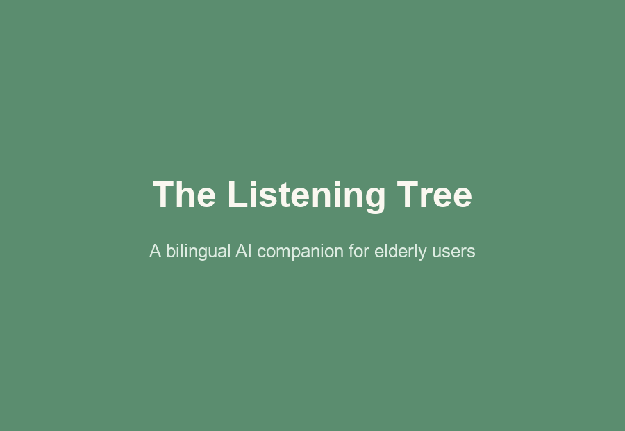

# The Listening Tree 🌳

Elderly-friendly AI companion for English and Cantonese conversations, reminders, wellness support, and accessible voice-first interaction.



## Table of Contents

- [Overview](#overview)
- [Problem Statement](#problem-statement)
- [Core Solution](#core-solution)
- [Key Features](#key-features)
- [Tech Stack](#tech-stack)
- [System Architecture](#system-architecture)
- [Project Layout](#project-layout)
- [Quick Start](#quick-start)
- [Core Workflow](#core-workflow)
- [Testing & Evaluation Methodology](#testing--evaluation-methodology)
- [Security & Privacy](#security--privacy)
- [Deployment](#deployment)
- [Future Improvements](#future-improvements)
- [License](#license)

## Overview

The Listening Tree is a bilingual AI-powered companion chatbot designed to reduce loneliness, enhance daily wellness, and improve digital accessibility for elderly users. It uses a voice-first, elderly-centric design to help older adults navigate modern technology with less friction.

## Problem Statement

Elderly populations face severe digital and social barriers:

- Loneliness crisis: a study reported by the [South China Morning Post](https://www.scmp.com/news/hong-kong/society/article/3280406/experts-sound-alarm-growing-number-hong-kong-elderly-become-socially-isolated) (29 Sep 2024) found 53% of people aged 65 and over in Hong Kong were socially isolated in 2023–24, up from 41.2% in 2017–18. Worldwide, the WHO says loneliness is linked to more than 871,000 deaths a year and affects 1 in 6 people ([WHO news release, 30 Jun 2025](https://who.int/news/item/30-06-2025-social-connection-linked-to-improved-heath-and-reduced-risk-of-early-death)); the same Commission on Social Connection report is quoted as putting the added risk of dementia at 50% ([Health Policy Watch](https://healthpolicy-watch.news/loneliness-social-isolation-linked-to-871000-annual-deaths-who-finds/)).
- Tech accessibility gaps: complex interfaces, tiny text, and confusing navigation make common apps difficult to use.
- Health management burden: missed medication schedules can lead to health risks.
- Limited social interaction: mobility or geographic restrictions can reduce daily social engagement and harm mental health.

## Core Solution

The Listening Tree delivers a compassionate, intuitive AI companion tailored for elderly users with four main goals:

- Simplicity and personalization: easy, customizable daily reminders for medication, exercise, and hydration.
- Voice-first interaction: hands-free operation via Cantonese and English voice commands.
- Elderly-centric design: WCAG AA-aligned UI with large buttons, high contrast, and minimal clutter.
- Security and reliability: automated tests cover authentication, access control and the core flows; the privacy limits that remain are listed under [Security & Privacy](#security--privacy).

## Key Features

- Bilingual AI chatbot: warm, patient conversations powered by Zhipu AI GLM-4 LLM in English and Cantonese.
- Voice interaction: Web Speech API for real-time speech recognition and synthesis.
- Smart reminder system: medication and activity reminders that can repeat every day, created and deleted from the reminder panel or by chat command. An in-app alarm (looping sound + on-screen alert) fires on whichever page is open; on the native mobile build, reminders are also scheduled as local OS notifications so they still fire while the app is backgrounded or closed.
- Conversation history: dedicated history page for browsing, pinning, tagging, renaming, and deleting past conversations, separate from the always-current active chat.
- Cross-platform support: responsive web app plus native iOS and Android builds via Capacitor.
- Accessibility optimization: large typography, high-contrast themes, and simplified navigation.
- Cognitive wellness tools: bilingual memory games, and a time-of-day check-in greeting ("How did you sleep? Have you had breakfast?") when the user comes back after 6 or more hours away.
- HK localized utilities: public holiday calendar, local news feed, and daily life guidance.

## Tech Stack

### Frontend

- Core: Next.js 16 (App Router) with React 19 and TypeScript, in `web-next/`
- Styling: plain CSS (`web-next/app/globals.css`), ported from the original stylesheet. No CSS framework — the ported markup still carries Bootstrap's utility class names, so the handful actually used are defined directly rather than pulling in the framework
- Libraries: FullCalendar (`@fullcalendar/react`) for the holiday calendar; Font Awesome and Google Fonts from CDN
- Legacy: the original Jinja2 templates (`templates/`, Bootstrap 5 + jQuery + FullCalendar via CDN) are still in the repo and still served by their FastAPI routes, kept until the migrated pages have proven stable in production
- Voice: Web Speech API for browser-native speech-to-text and text-to-speech, with a server-side `/transcribe` fallback (Hugging Face Whisper, then legacy Google Web Speech via `SpeechRecognition`) for browsers without Web Speech API support
- Mobile build: Capacitor 6 for iOS and Android packaging, with `@capacitor/local-notifications` for background reminder alarms
- Deployment: Vercel

### Backend

- Framework: FastAPI on Python 3.12+
- Server: Uvicorn ASGI server
- LLM integration: Zhipu AI GLM-4 Flash for bilingual conversations
- Security: PBKDF2-HMAC-SHA256 (per-user salt) for password hashing, python-multipart for form handling
- Auth: email/password with account lockout after repeated failed attempts, plus optional Google Sign-In (OAuth 2.0 via Authlib) — auto-links to an existing password account by email if one already exists
- API: RESTful endpoints for auth, chat, reminders, and utilities

### Database

- Database: PostgreSQL for secure relational persistence
- Core tables: `users`, `chat_history`, `reminders`, `preferences`, `email_verifications`, `conversations`
- Hosting: Supabase (managed PostgreSQL with connection pooler)
- Schema migrations: Alembic (`alembic/versions/`) — run `alembic upgrade
  head` after pulling a change that touches the schema; `python run.py`
  also bootstraps a brand-new database on its own for local dev
  convenience, but ongoing schema changes are written as Alembic revisions,
  not edits to that bootstrap code

### DevOps & Testing

- CI/CD: GitHub Actions — unit, integration and component tests, a Playwright end-to-end matrix across four browser/device projects, and a k6 load smoke test
- Testing: Playwright (end-to-end), pytest (backend unit and live-database API integration), Vitest with Testing Library (React hooks and components), k6 (load)
- Version control: Git with branch-based workflow

## System Architecture

The project follows a modular three-layer architecture designed for stability and maintainability:

- Frontend layer: a Next.js (App Router, TypeScript) app in `web-next/` serving every page — chat, login, register, profile, accessibility, HK guide, and conversation history — plus a standalone Capacitor shell (`www/`) for the mobile build. The original Jinja2 templates (`templates/`) are still in the repo and still rendered by their FastAPI routes; they're kept until the migrated pages have proven stable in production, then removed.
- Backend API layer: FastAPI service handling business logic, LLM integration, authentication, and database operations.
- Database layer: PostgreSQL storing user profiles, chat history, reminders, and preferences with optimized indexing.

## Project Layout

| Path | Purpose |
|---|---|
| `web-next/` | Next.js front end (every page), with its hook and component tests in `web-next/tests/` |
| `app/` | FastAPI backend: routers, services, database layer |
| `alembic/` | Database migrations |
| `api/` | Vercel serverless entry point for the backend |
| `templates/`, `static/` | Legacy Jinja2 pages, plus shared static files (images, notification sound, speech helper) |
| `www/`, `capacitor.config.ts` | Capacitor shell for the mobile build |
| `tests/` | End-to-end (`e2e/`), API integration (`integration/`), backend unit tests, k6 load test (`stress/`) and shared helpers (`support/`) |
| `docs/` | Documentation, including the test plan and results ([`TESTING.md`](docs/TESTING.md)) |
| `icons/`, `assets/` | App icons and mobile icon/splash sources |
| `scripts/` | Helper scripts (translation sync, test database setup, mobile dev) |
| `translations.py` | Single source of truth for English and Cantonese strings |

## Quick Start

Two processes run side by side: the FastAPI backend, and the Next.js app
in `web-next/` that serves every page. In production a single
`vercel.json` `services`/`rewrites` config puts both behind one origin —
page routes go to `web-next`, everything else (the JSON API, `/static`,
OAuth, language switching) to FastAPI. Locally they're two dev servers,
so you need both running.

### Backend

```bash
pip install -r requirements.txt
python run.py            # http://localhost:5000
PORT=5001 python run.py  # or on a different port
```

### `web-next/`

```bash
cd web-next
npm install
npm run dev               # http://localhost:3001
```

Locally the two run as separate origins, so `web-next/.env.local`
(gitignored) needs `NEXT_PUBLIC_API_BASE` pointed at wherever the
backend is running, e.g.:

```
NEXT_PUBLIC_API_BASE=http://localhost:5000
```

In production both are deployed together behind one origin via
`vercel.json`'s `services`/`rewrites` config, so this env var is unset
there (same-origin relative fetches).

### Running the tests

```bash
npm run test:unit                # repository-root unit tests
(cd web-next && npm test)        # React hook and component tests
npm run test:backend             # backend unit tests (mocked database)
npm run e2e:db                   # once: create the local test database
npm run test:integration         # API integration tests (local test database)
npm run test:e2e                 # Playwright; starts both servers itself
npm run test:stress              # k6 load test (PROFILE=smoke for a short run)
```

The end-to-end and load tests use their own local database and never touch
`.env.local` or production. Prerequisites, criteria and results are in
[docs/TESTING.md](docs/TESTING.md).

### Mobile (Capacitor)

The native `ios/` and `android/` projects are generated, not committed. Create
them with `npm run cap:add:ios` or `npm run cap:add:android`, then
`npm run mobile:ios` / `npm run mobile:android` to sync and open them.

## Core Workflow

### 1. User Onboarding

- Registration with email verification code (sent via Azure Communication Services) and login with email authentication, or sign in directly with Google.
- Bilingual setup in English or Cantonese plus theme selection for standard or high-contrast mode.
- AI voice greeting for a friendly first experience.

### 2. Reminder Management

- Create reminders from the reminder panel (tick "Repeat every day" for a daily one) or by chat command or dictation, for example `set reminder daily BP meds 08:00` or `設置提醒 每日 食藥 08:00`. Without "daily" a reminder rings once, on the day it was created.
- AI confirms the details in large text.
- Delete a reminder from the panel or with `delete reminder BP meds`. There is no edit: delete it and create it again.

### 3. Bilingual Interaction

- Voice queries in Cantonese or English for weather, time, and daily tips.
- AI responds in the user’s language with clear, slow speech.
- Seamless language switching with one click.

## Testing & Evaluation Methodology

### Automated testing

- End-to-end (Playwright): 84 user-flow tests on each of Chromium, WebKit, Pixel 5 and iPhone 13 (336 runs), against the real Next.js and FastAPI stack: registration and login, language switching on every page, chat, the cognitive game, voice input, reminders (including daily repeat), the site-wide alarm and the returning-user check-in, conversation history and delete, profile, and the HK guide.
- API integration (pytest, local PostgreSQL): 21 tests covering conversation ownership and delete, session language, translations, security boundaries, and the expiry job keeping daily reminders. Backend unit tests: 25.
- Unit and component tests (Vitest, Testing Library): 69 tests covering the language hooks, loading screen, delete-confirmation flow, the guard that keeps tests off non-local databases, and a check that English and Cantonese carry the same translation keys.
- Load testing (k6): ramps to 150 concurrent virtual users against a local backend with 0% failed requests and a p95 latency of about 12 ms for authenticated requests. This is measured on a local machine, not on the Vercel deployment.
- CI/CD automation: GitHub Actions runs the unit, integration and `web-next` tests, a Playwright end-to-end matrix (one job per browser project) and a k6 smoke run on every push and pull request to `main`/`develop`. See [docs/TESTING.md](docs/TESTING.md) for the test plan, criteria, results and how to repeat them.

### Known evaluation gaps

Automated test pass rate reflects functional correctness, not usability. The project does not yet include:

- A formal System Usability Scale (SUS) study with elderly test participants.
- Load testing of the deployed (Vercel) system; the local load test found no degradation up to 150 virtual users, so the capacity limit is unknown.
- Automated coverage of AI answer quality, email delivery, and Google sign-in.
- A structured user feedback or focus-group study.

These are tracked as future work (see [Future Improvements](#future-improvements)).

## Security & Privacy

- Password storage: PBKDF2-HMAC-SHA256 with a unique per-user salt (390,000 iterations), never plaintext or reversibly encrypted.
- Session integrity: session signing key is read from `SECRET_KEY`/`SESSION_SECRET`; in production, startup fails fast if no persistent secret is configured, preventing silent use of a throwaway key that would invalidate all sessions on restart.
- Verification code abuse prevention: `/send_verification_code` enforces a server-side cooldown per email address, rejecting rapid repeat requests with HTTP 429.
- Database access: connections use Supabase's managed connection pooler rather than raw per-request connections; credentials are read from environment variables, never hardcoded.
- SQL injection prevention: all queries use parameterized placeholders via the `db_execute` helper.
- Rate limiting: per-IP limits of 10 login attempts, 5 registrations and 5 verification-code requests per minute, stored in PostgreSQL so they hold across serverless instances, in addition to account lockout after repeated failures.
- Access control: conversations and reminders belong to their owner; automated tests check that another user is refused on read, pin, tag, rename, delete and write.
- Output handling: user-supplied text is rendered as text (tests cover HTML in messages, reminder labels and conversation titles), and the language-switch redirect only ever returns known local pages.

### Where user data goes

- Chat: each message and up to the last 20 messages of that conversation are sent to Zhipu AI (`open.bigmodel.cn`, a China-based provider) to generate the reply. Do not present the app as keeping conversations private to this service.
- Voice: by default a browser's Web Speech API sends the audio to an online recognition service ([MDN](https://developer.mozilla.org/en-US/docs/Web/API/Web_Speech_API/Using_the_Web_Speech_API)), so dictation is not on-device. Only browsers without the API fall back to uploading the recording to our `/transcribe` endpoint (Hugging Face Whisper, then Google Web Speech).
- Consent: registration has a privacy notice but no explicit consent step for these transfers.

### Known gaps

- No self-harm or crisis detection: a message about wanting to die gets the same LLM reply as any other message, with no hotline referral or alert to a carer. This must be added before real elderly users rely on it.
- Encryption-at-rest relies on Supabase's underlying infrastructure and is not independently documented or verified at the application level.
- No formal written threat model.
- No documented data retention / deletion policy for user accounts and chat history.

## Deployment

- Web: hosted on Vercel at https://the-listening-tree.vercel.app/
- Mobile: native iOS and Android apps built via Capacitor for App Store and Google Play readiness.
- Database: managed PostgreSQL on Supabase for secure and scalable storage.

## Future Improvements

- Formal usability evaluation with an elderly test group, using the System Usability Scale (SUS) methodology.
- Self-harm / crisis detection with a fixed hotline reply, and an explicit consent step for the third-party processing above.
- Documented threat model and data retention / deletion policy.
- Advanced analytics dashboard for usage and wellness tracking.
- Offline mode support for low-connectivity environments.
- Multi-language expansion for additional regional dialects.

## License

Released under the [GNU General Public License v3.0](LICENSE). Third-party libraries and assets keep their own licenses.
